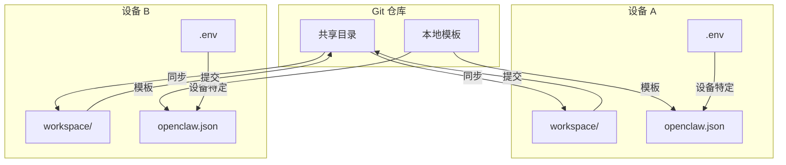

# OpenClaw 多设备同步目录结构设计

## 设计目标
1. **无缝衔接**：主进程及所有子进程的记忆、角色定位、任务等
2. **技能文件**：用到可以单独配置，不一定同步
3. **同步方式**：通过 GitHub 同步
4. **设备差异**：家庭电脑和公司电脑可能有不同的设备特定配置

## 当前目录结构分析

```
~/.openclaw/
├── workspace/          # 工作区（含记忆文件、技能、项目）→ 需要同步
├── agents/            # agent 配置（含 auth-profiles.json, models.json）→ 部分同步
├── openclaw.json      # 主配置文件 → 设备特定
├── browser/           # 浏览器配置 → 设备特定
├── logs/              # 日志 → 设备特定
├── subagents/         # 子进程数据 → 设备特定
├── tasks/             # 任务数据 → 需要同步
├── devices/           # 设备配对信息 → 设备特定
├── memory/            # 全局记忆层 → 需要同步
├── identity/          # 设备身份 → 设备特定
├── credentials/       # 凭证 → 设备特定
├── cron/              # 定时任务 → 需要同步
├── flows/             # 工作流 → 需要同步
└── ...
```

## 目录分类策略

### 1. 需要同步的目录（Shared - 通过 Git 同步）
这些目录包含用户数据、记忆、配置模板，需要在设备间保持一致：

- `workspace/` - 工作区（核心记忆、项目文件）
  - `memory/` - 每日记忆文件
  - `skills/` - 技能文件（按需同步）
  - `scripts/` - 脚本文件
  - `state/` - 状态文件
  - 核心身份文件：`AGENTS.md`, `SOUL.md`, `IDENTITY.md`, `USER.md`, `MEMORY.md`, `TOOLS.md`

- `memory/` - 全局记忆层（与 workspace/memory/ 合并）

- `tasks/` - 任务数据

- `cron/` - 定时任务配置

- `flows/` - 工作流定义

- `agents/` - Agent 配置模板
  - `agents/*/agent/` - Agent 定义文件
  - `agents/*/config/` - 配置模板

### 2. 设备特定的目录（Local - 不通过 Git 同步）
这些目录包含设备特定的运行时数据、日志、凭证：

- `openclaw.json` - 主配置文件（设备特定覆盖）
- `browser/` - 浏览器配置（CDP URL、端口等）
- `logs/` - 日志文件
- `subagents/` - 子进程运行时数据
- `devices/` - 设备配对信息
- `identity/` - 设备身份文件
- `credentials/` - API 密钥、令牌等
- `.env` - 环境变量（包含设备特定配置）
- `exec-approvals.json` - 执行审批状态
- `update-check.json` - 更新检查状态

### 3. 按需同步的目录（Optional - 选择性同步）
- `skills/` - 技能文件（大文件或实验性技能可选择性同步）
- `workspace/*/` - 特定项目工作区（可选择同步）

## 同步策略

### Git 仓库结构
```
openclaw-sync/
├── .gitignore
├── README.md
├── shared/
│   ├── workspace/
│   │   ├── memory/
│   │   ├── skills/
│   │   ├── AGENTS.md
│   │   ├── SOUL.md
│   │   ├── IDENTITY.md
│   │   ├── USER.md
│   │   ├── MEMORY.md
│   │   └── TOOLS.md
│   ├── tasks/
│   ├── cron/
│   ├── flows/
│   └── agents/
│       ├── main/
│       ├── windows-ops/
│       └── ...
└── local/
    ├── .env.example
    ├── openclaw.json.example
    └── README-local.md
```

### 配置覆盖机制

#### 1. 环境变量覆盖
- 使用 `.env` 文件存储设备特定配置
- `.env.example` 提供模板
- 敏感信息（API 密钥）通过环境变量注入

#### 2. 配置文件覆盖
- `openclaw.json` 使用设备特定版本
- 通过环境变量 `OPENCLAW_CONFIG_PATH` 指定配置文件路径
- 或使用符号链接指向设备特定配置

#### 3. 分层配置系统
```
1. 默认配置（内置）
2. 共享配置（shared/openclaw.base.json）
3. 设备配置（local/openclaw.local.json）
4. 环境变量覆盖
5. 命令行参数
```

## 记忆层同步方案

### 记忆文件位置
```
~/.openclaw/workspace/memory/YYYY-MM-DD.md    # 每日记忆（同步）
~/.openclaw/workspace/MEMORY.md               # 长期记忆（同步）
~/.openclaw/memory/                           # 全局记忆（已合并到 workspace）
```

### 同步策略
1. **实时同步**：Git 提交 + 推送
2. **冲突解决**：
   - 时间戳合并：保留最新修改
   - 人工审核：重大冲突提示用户
   - 自动备份：冲突文件备份为 `.conflict` 后缀
3. **同步频率**：
   - 自动：每次重要记忆更新后提交
   - 手动：用户可触发同步
   - 定时：每小时自动同步一次

## 角色定位同步

### 身份文件同步
```
shared/workspace/
├── AGENTS.md    # Agent 工作流定义
├── SOUL.md      # 核心人格定义
├── IDENTITY.md  # 当前身份
├── USER.md      # 用户信息
└── MEMORY.md    # 长期记忆
```

### 标签系统
- 使用 Git 标签标记重要版本
- 标签格式：`identity-v1.0`, `memory-2026-04-07`
- 支持快速回滚到特定身份状态

## 技能文件处理

### 同步策略
1. **核心技能**：必须同步（常用、稳定）
2. **实验技能**：选择性同步（标记为 `experimental/`）
3. **大型技能**：Git LFS 或选择性下载
4. **设备特定技能**：不同步（存储在 `local/skills/`）

### 技能目录结构
```
shared/workspace/skills/
├── core/           # 核心技能（必须同步）
├── experimental/   # 实验技能（选择性同步）
└── device/         # 设备特定技能（不同步，仅模板）
```

## .gitignore 模板

```gitignore
# 设备特定文件
/local/
/openclaw.json
/browser/
/logs/
/subagents/
/devices/
/identity/
/credentials/
/.env
/exec-approvals.json
/update-check.json

# 运行时文件
*.log
*.tmp
*.pid
*.lock
*.swp
*.swo

# 大文件
*.zip
*.tar
*.gz
*.7z

# 虚拟环境
.venv/
venv/
env/
ENV/

# 编辑器文件
.vscode/
.idea/
*.swp
*.swo

# 操作系统文件
.DS_Store
Thumbs.db

# 临时文件
tmp/
temp/
```

## 环境变量清单

### 必须的设备特定环境变量
```bash
# 设备标识
OPENCLAW_DEVICE_ID=home-pc  # 或 work-pc
OPENCLAW_DEVICE_NAME="家庭电脑"

# 浏览器配置
OPENCLAW_BROWSER_CDP_URL=http://172.31.208.1:9223  # Windows 特定
OPENCLAW_BROWSER_DEFAULT_PROFILE=chrome-relay

# API 密钥（设备特定）
DEEPSEEK_API_KEY=sk-xxx
OPENAI_API_KEY=sk-xxx
DISCORD_BOT_TOKEN=xxx

# 网络配置
OPENCLAW_GATEWAY_PORT=18789
OPENCLAW_GATEWAY_TOKEN=xxx
```

### 共享环境变量模板（.env.example）
```bash
# 设备标识（每台设备需要修改）
OPENCLAW_DEVICE_ID=DEVICE_ID_HERE
OPENCLAW_DEVICE_NAME="设备名称"

# 浏览器配置（设备特定）
OPENCLAW_BROWSER_CDP_URL=http://localhost:9222
OPENCLAW_BROWSER_DEFAULT_PROFILE=openclaw

# API 密钥占位符
DEEPSEEK_API_KEY=your_deepseek_api_key_here
OPENAI_API_KEY=your_openai_api_key_here
DISCORD_BOT_TOKEN=your_discord_bot_token_here

# 网络配置
OPENCLAW_GATEWAY_PORT=18789
OPENCLAW_GATEWAY_TOKEN=your_gateway_token_here
```

## 迁移步骤

### 步骤 1：备份当前配置
```bash
# 备份整个 .openclaw 目录
cp -r ~/.openclaw ~/.openclaw.backup.$(date +%Y%m%d)
```

### 步骤 2：创建 Git 仓库
```bash
mkdir -p ~/openclaw-sync
cd ~/openclaw-sync
git init
```

### 步骤 3：组织共享文件
```bash
# 创建目录结构
mkdir -p shared/workspace
mkdir -p shared/tasks
mkdir -p shared/cron
mkdir -p shared/flows
mkdir -p shared/agents
mkdir -p local

# 复制共享文件
cp -r ~/.openclaw/workspace/* shared/workspace/
cp -r ~/.openclaw/tasks/ shared/tasks/
cp -r ~/.openclaw/cron/ shared/cron/
cp -r ~/.openclaw/flows/ shared/flows/
cp -r ~/.openclaw/agents/ shared/agents/

# 创建设备特定配置模板
cp ~/.openclaw/.env local/.env.example
cp ~/.openclaw/openclaw.json local/openclaw.json.example
```

### 步骤 4：创建同步脚本
创建 `sync-openclaw.sh`：
```bash
#!/bin/bash
# OpenClaw 同步脚本

set -e

OPENCLAW_HOME="$HOME/.openclaw"
SYNC_REPO="$HOME/openclaw-sync"

# 1. 拉取最新更改
cd "$SYNC_REPO"
git pull origin main

# 2. 同步共享文件到本地
rsync -av --delete "$SYNC_REPO/shared/workspace/" "$OPENCLAW_HOME/workspace/"
rsync -av --delete "$SYNC_REPO/shared/tasks/" "$OPENCLAW_HOME/tasks/"
rsync -av --delete "$SYNC_REPO/shared/cron/" "$OPENCLAW_HOME/cron/"
rsync -av --delete "$SYNC_REPO/shared/flows/" "$OPENCLAW_HOME/flows/"
rsync -av --delete "$SYNC_REPO/shared/agents/" "$OPENCLAW_HOME/agents/"

# 3. 提交本地更改到仓库
cd "$SYNC_REPO"
git add .
git commit -m "Sync: $(date +%Y-%m-%d_%H:%M:%S)"
git push origin main

echo "同步完成"
```

### 步骤 5：配置自动同步
```bash
# 添加到 crontab（每小时同步一次）
(crontab -l 2>/dev/null; echo "0 * * * * $HOME/openclaw-sync/sync-openclaw.sh") | crontab -
```

### 步骤 6：初始化新设备
```bash
# 在新设备上克隆仓库
git clone <your-repo-url> ~/openclaw-sync

# 运行初始化脚本
cd ~/openclaw-sync
./init-device.sh
```

## 同步方案图（Mermaid）



## ASCII 结构图

```
┌─────────────────────────────────────────────────────────────┐
│                    Git 仓库 (openclaw-sync)                  │
├─────────────────────────────────────────────────────────────┤
│  shared/                    │  local/                       │
│  ├── workspace/            │  ├── .env.example            │
│  │   ├── memory/          │  ├── openclaw.json.example   │
│  │   ├── skills/          │  └── README-local.md         │
│  │   ├── AGENTS.md        │                               │
│  │   └── ...              │                               │
│  ├── tasks/               │                               │
│  ├── cron/                │                               │
│  ├── flows/               │                               │
│  └── agents/              │                               │
└─────────────────────────────────────────────────────────────┘
         │                               │
         ▼                               ▼
┌─────────────────┐             ┌─────────────────┐
│   设备 A        │             │   设备 B        │
├─────────────────┤             ├─────────────────┤
│ ~/.openclaw/    │             │ ~/.openclaw/    │
│ ├── workspace/  │◄──同步─────►│ ├── workspace/  │
│ ├── .env        │             │ ├── .env        │
│ └── openclaw.json│             │ └── openclaw.json│
└─────────────────┘             └─────────────────┘
```

## 实施时间线

### 阶段 1：设计验证（今日）
- [x] 分析当前目录结构
- [x] 设计同步方案
- [x] 创建设计文档

### 阶段 2：原型实现（1-2天）
- [ ] 创建 Git 仓库结构
- [ ] 实现同步脚本
- [ ] 测试基本同步功能

### 阶段 3：完整迁移（2-3天）
- [ ] 迁移现有数据
- [ ] 配置自动同步
- [ ] 测试多设备场景

### 阶段 4：优化维护（持续）
- [ ] 监控同步状态
- [ ] 优化冲突解决
- [ ] 添加备份机制

## 风险评估与缓解

### 风险 1：配置冲突
- **缓解**：使用分层配置，设备特定配置优先
- **缓解**：提供冲突检测和解决工具

### 风险 2：数据丢失
- **缓解**：实施自动备份机制
- **缓解**：Git 提供版本历史
- **缓解**：重要操作前提示确认

### 风险 3：同步延迟
- **缓解**：实时提交重要更改
- **缓解**：提供手动同步按钮
- **缓解**：监控同步状态

### 风险 4：安全泄露
- **缓解**：敏感信息通过环境变量管理
- **缓解**：.gitignore 排除敏感文件
- **缓解**：使用私有 Git 仓库

## 协作接口

### 与 plan 协作
- 评估迁移时间线和资源需求
- 制定分阶段实施计划
- 识别依赖关系和风险点

### 与 env-engineer 协作
- 设计环境变量管理系统
- 配置设备特定覆盖机制
- 优化配置加载顺序

### 与 coder 协作
- 实现同步脚本和工具
- 集成到 OpenClaw 核心系统
- 添加配置管理 API

## 下一步行动

1. **立即行动**：创建 Git 仓库并初始化结构
2. **短期行动**：实现基本同步脚本
3. **中期行动**：测试多设备同步场景
4. **长期行动**：集成到 OpenClaw 自动化工作流

---
*设计完成时间：2026-04-07*
*设计者：architect（架构师）*